# Hadejia River Watershed Hydrological Assessment

## 1. Project Overview

This project assesses the hydrological characteristics and observed streamflow behaviour of the Hadejia River watershed in northern Nigeria using **QGIS, QSWAT, and Python**.

The analysis combines GIS-based watershed delineation, terrain and drainage analysis, land-cover assessment, and observed streamflow analysis from the Wudil gauge.

### Project Aim

> **To assess the hydrological behaviour of the Hadejia River watershed by analysing observed streamflow variability and its relationship with watershed characteristics using GIS and Python.**

The project focuses on two complementary components:

* **Spatial watershed analysis:** watershed delineation, terrain characteristics, drainage-network and morphometric analysis, and land-cover assessment using QGIS and QSWAT.
* **Observed streamflow analysis:** processing and analysis of daily discharge observations from the Wudil gauge using Python and Jupyter Notebook.

The objective is to provide an integrated description of the watershed's physical characteristics and the temporal behaviour of observed streamflow. The project uses observed discharge and GIS-derived watershed characteristics and does **not** constitute a rainfall–runoff simulation or full SWAT modelling study.

---

## 2. Project Focus

* Watershed Hydrology
* Surface-Water Analysis
* GIS and Spatial Analysis
* Terrain and Morphometric Analysis
* Drainage-Network Analysis
* Streamflow Variability
* Hydrological Time-Series Analysis
* Land-Cover Analysis
* Water Resources Assessment

---

## 3. Tools and Technologies

* **QGIS** — spatial analysis, terrain processing, morphometric analysis, and cartographic production
* **QSWAT** — watershed delineation, subbasin generation, and drainage-network extraction
* **Python** — hydrological data processing and statistical analysis
* **Jupyter Notebook** — reproducible streamflow analysis and visualization
* **Pandas** — time-series data processing
* **NumPy** — numerical analysis
* **SciPy** — linear regression and statistical calculations
* **Matplotlib** — hydrological data visualization

---

## 4. Study Area

The study focuses on the **Hadejia River watershed in northern Nigeria**, with the **Wudil gauge (GRDC Station ID: 1837410)** used as the reference streamflow observation point.

The final watershed boundary was delineated using **QSWAT** from a 30 m SRTM digital elevation model. The delineation produced **10 subbasins** and a mapped drainage network containing **791.96 km of reaches**.

The delineated watershed covers approximately **22,619.66 km²**, with an elevation range of **334.07–1,568.76 m**, a total relief of **1,234.69 m**, and an area-weighted mean slope of **2.16°**.

Observed daily discharge data from the Wudil gauge were analysed for the **1976–1990** study period.

### Study Area Overview

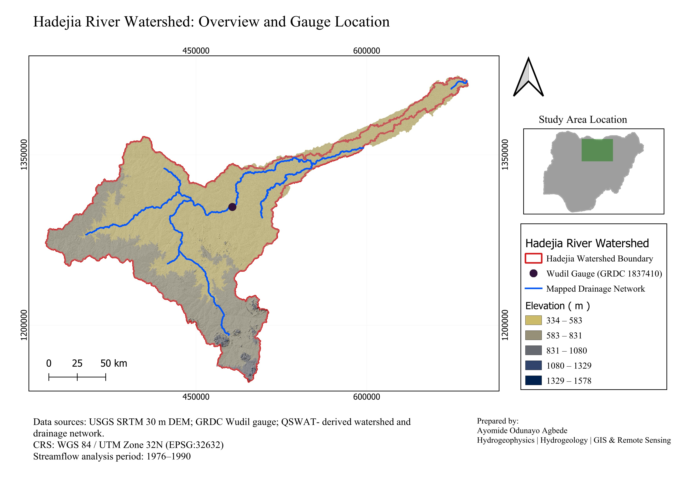

---

## 5. Data Sources

The project combines elevation, watershed reference, land-cover, and observed hydrological datasets.

| Dataset                        | Source                   | Purpose                                                      |
| ------------------------------ | ------------------------ | ------------------------------------------------------------ |
| 30 m SRTM DEM                  | USGS EarthExplorer       | Elevation, terrain analysis, and watershed delineation       |
| HydroBASINS Africa Level 6     | HydroSHEDS / HydroBASINS | Preliminary watershed reference and DEM acquisition envelope |
| Wudil streamflow observations  | GRDC, Station 1837410    | Observed daily discharge analysis                            |
| ESA WorldCover 2021            | European Space Agency    | Land-cover analysis                                          |
| QSWAT-derived watershed        | Derived in QGIS/QSWAT    | Final watershed and subbasin boundaries                      |
| QSWAT-derived drainage network | Derived in QGIS/QSWAT    | Drainage-network and morphometric analysis                   |

The observed streamflow analysis covers **1976–1990**.

Detailed data provenance and source information are provided in [`documentation/DATA_SOURCES.md`](documentation/DATA_SOURCES.md).

---

# 6. Methodology

The project combines spatial analysis in **QGIS/QSWAT** with hydrological time-series analysis in **Python**.

### 6.1 Watershed Delineation

A HydroBASINS Africa Level 6 basin was first used as a preliminary geographic reference for the Hadejia/Wudil system and to help define the area required for DEM acquisition.

A 30 m SRTM DEM was obtained from USGS EarthExplorer, mosaicked, clipped, and reprojected to **WGS 84 / UTM Zone 32N (EPSG:32632)**.

The final watershed was delineated using **QSWAT**, with the Wudil gauge location used to guide the watershed outlet. The delineation produced **10 subbasins**.

The HydroBASINS polygon was **not used as the final watershed boundary**.

### 6.2 Terrain Analysis

The DEM was used to analyse:

* Elevation
* Elevation statistics
* Relief
* Slope
* Watershed area
* Watershed perimeter

Zonal statistics were calculated using the final watershed and subbasin geometries.

Key terrain results include:

* Minimum elevation: **334.07 m**
* Maximum elevation: **1,568.76 m**
* Mean elevation: **552.53 m**
* Relief: **1,234.69 m**
* Area-weighted mean slope: **2.16°**

The watershed-specific slope raster was classified into three classes:

| Slope     | Class          |
| --------- | -------------- |
| **0–5°**  | Low Slope      |
| **5–10°** | Moderate Slope |
| **>10°**  | Steep Slope    |

### 6.3 Drainage Network Analysis

The QSWAT-derived drainage network was analysed to obtain mapped reach length, stream order, drainage density, and mapped reach frequency.

Results include:

* Total mapped reach length: **791.96 km**
* Total mapped reaches: **10**
* Highest mapped stream order: **3rd order**
* Mapped drainage density: **0.0350 km/km²**
* Mapped reach frequency: **0.000442 reaches/km²**

These values describe the **QSWAT-derived mapped drainage network** and should not be interpreted as a complete inventory of every natural channel within the watershed.

### 6.4 Land-Cover Analysis

ESA WorldCover 2021 was used to examine land-cover distribution within the watershed.

The analysed classes include:

* Tree cover
* Shrubland
* Grassland
* Cropland
* Built-up
* Bare / sparse vegetation
* Permanent water bodies
* Herbaceous wetland

### 6.5 Streamflow Analysis

Daily observed discharge data from the Wudil gauge were processed using Python.

The analysis period was restricted to **1976–1990**, resulting in **5,479 daily observations** with no missing discharge values after quality control.

The streamflow analysis includes:

* Daily streamflow hydrograph
* Monthly mean streamflow
* Annual mean streamflow
* Flow Duration Curve
* Q10, Q50 and Q90 flow characteristics
* Monthly streamflow climatology
* High- and low-flow thresholds
* Recorded zero-discharge days
* Annual coefficient of variation

### 6.6 Trend Analysis

Annual mean discharge was calculated from the daily observations and analysed using a simple linear regression against year.

The fitted trend produced:

* Slope: **−0.21 m³/s/year**
* R²: **0.0029**
* p-value: **0.8485**

The fitted linear relationship explains very little of the variation in annual mean discharge, with no statistical evidence of a detectable linear trend over the 1976–1990 study period.

---

# 7. Watershed Characteristics

## Map 1 — Watershed Overview and Gauge Location

The overview map shows the final watershed boundary, elevation context, mapped drainage network, and Wudil gauge location.


---

## Map 2 — Subbasins and Drainage Network

The watershed was divided into **10 QSWAT subbasins**. The map also shows the mapped drainage network and Wudil gauge location.

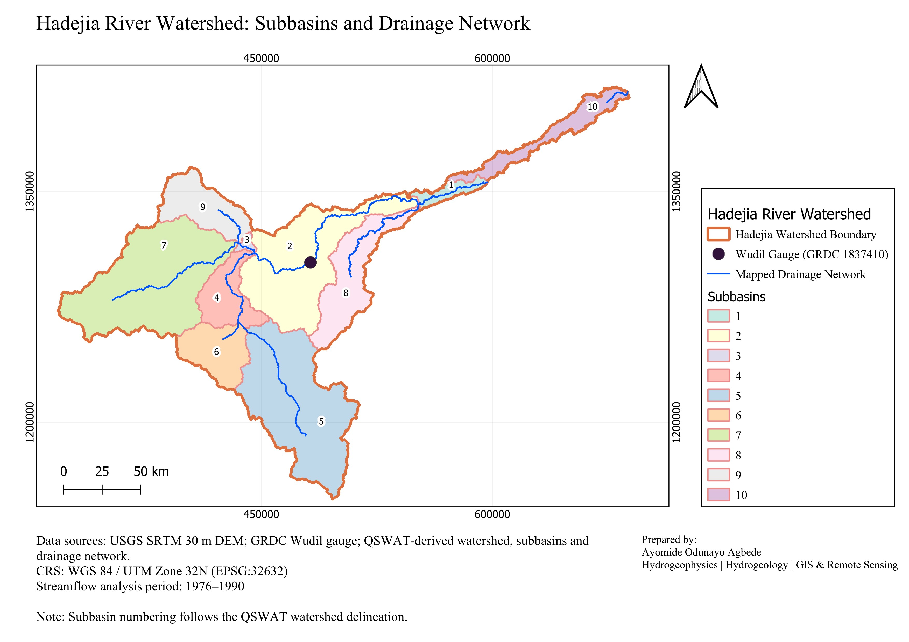

---

## Map 3 — Slope Map

Slope was derived from the 30 m SRTM DEM and classified into three classes for hydrological representation.

* **0–5° — Low Slope**
* **5–10° — Moderate Slope**
* **>10° — Steep Slope**

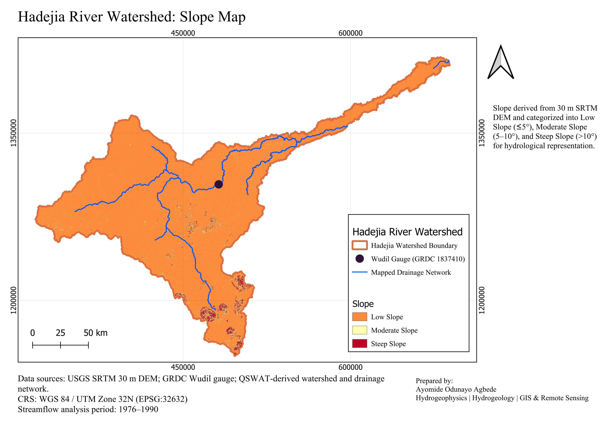

---

## Map 4 — Land-Cover Map

The land-cover map shows the spatial distribution of ESA WorldCover 2021 classes within the final watershed boundary.

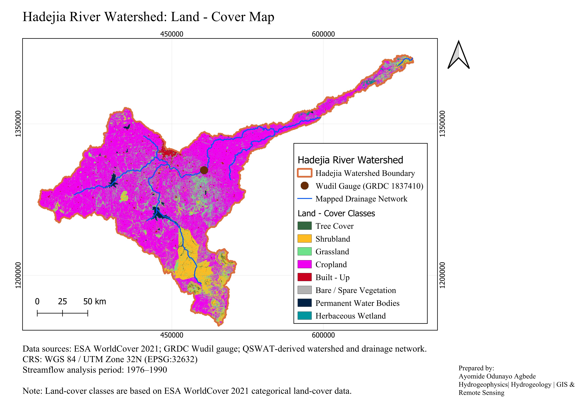

---

# 8. Observed Streamflow Analysis

## 8.1 Daily Streamflow

The daily hydrograph shows observed discharge variation at the Wudil gauge throughout the 1976–1990 study period.

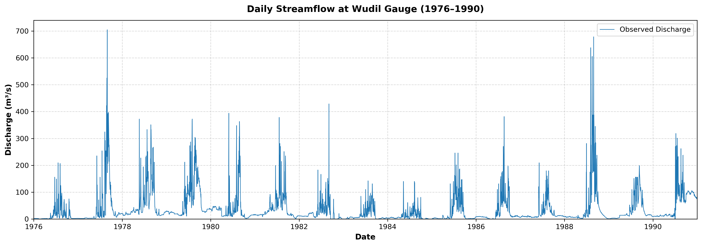

The dataset contains **5,479 daily observations**. Mean discharge was **35.32 m³/s**, while median discharge was **14.00 m³/s**.

---

## 8.2 Monthly Mean Streamflow

Monthly mean discharge was calculated from the daily observations to examine monthly changes in streamflow.

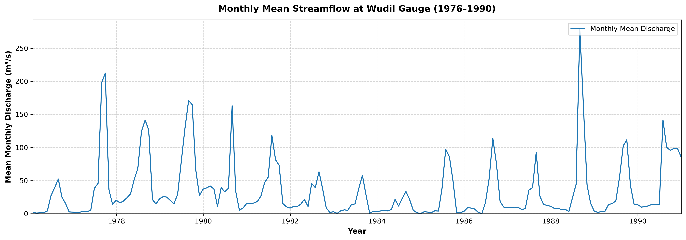

---

## 8.3 Annual Mean Streamflow

Annual mean discharge was calculated for each year from 1976 to 1990.

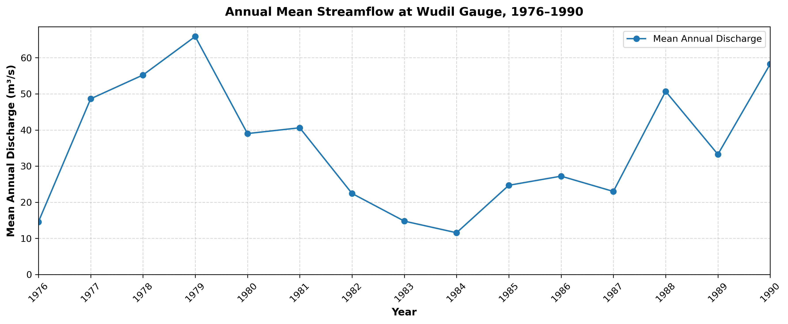

Annual mean discharge ranged from approximately **11.56 m³/s in 1984** to **65.88 m³/s in 1979**.

---

## 8.4 Flow Duration Curve

The Flow Duration Curve describes the percentage of time that different discharge levels were equalled or exceeded.

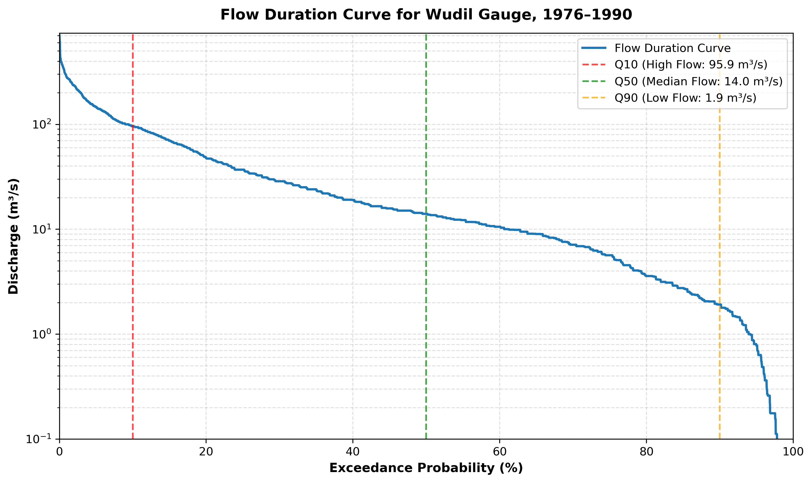

| Indicator |     Discharge |
| --------- | ------------: |
| Q10       | **95.9 m³/s** |
| Q50       | **14.0 m³/s** |
| Q90       |  **1.9 m³/s** |

Q10 represents a relatively high-flow condition exceeded approximately 10% of the time, Q50 represents the median discharge, and Q90 represents a relatively low-flow condition exceeded approximately 90% of the time.

---

## 8.5 Seasonal Streamflow Pattern

Monthly climatology was calculated by grouping daily observations by calendar month across the study period.

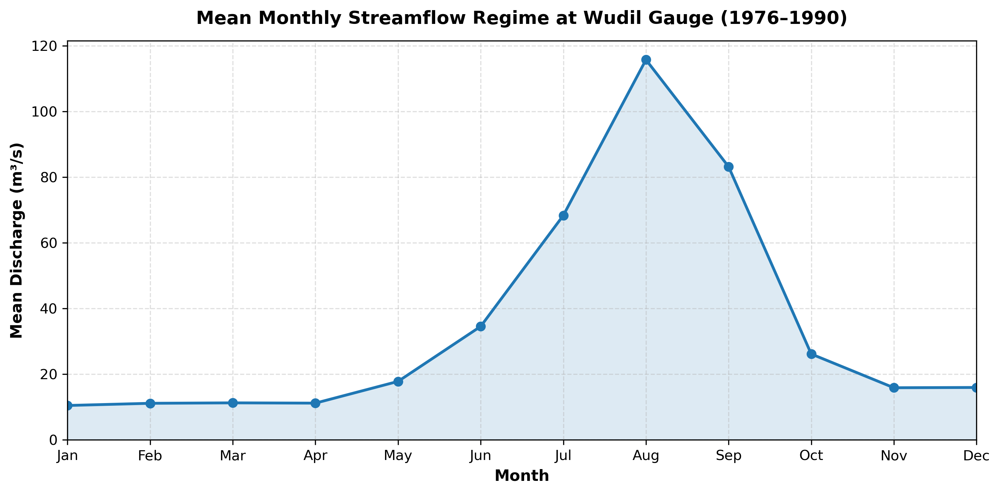

Average streamflow is generally lower from **January to April**, increases through May and June, reaches its highest monthly average in **August (115.80 m³/s)**, and declines through September and October.

---

## 8.6 High- and Low-Flow Conditions

The 90th and 10th percentiles of daily discharge were used as descriptive high- and low-flow thresholds.

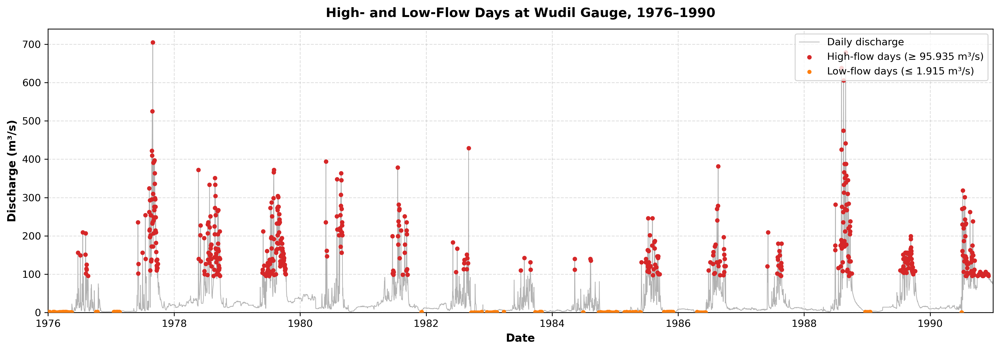

* High-flow threshold: **95.94 m³/s**
* High-flow days: **552**
* Low-flow threshold: **1.92 m³/s**
* Low-flow days: **555**

---

## 8.7 Recorded Zero-Discharge Days

A total of **60 recorded zero-discharge days** occurred during the study period, representing approximately **1.10%** of the daily observations.

The recorded zero-discharge days were concentrated in a small number of years, with **1984 accounting for 28 days**.

These are reported as recorded zero-discharge values in the gauge dataset and are not independently interpreted as evidence of the physical absence of flow.

---

## 8.8 Annual Variability

Annual coefficients of variation were calculated from daily discharge values within each year.

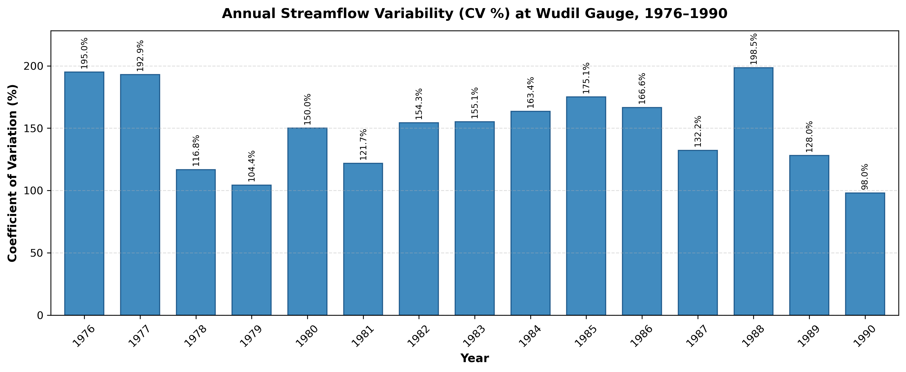

The annual CV values range from approximately **98.01% to 198.46%**, indicating substantial within-year variability in daily discharge.

---

# 9. Streamflow Trend Analysis

Annual mean discharge was analysed using simple linear regression for the 1976–1990 period.

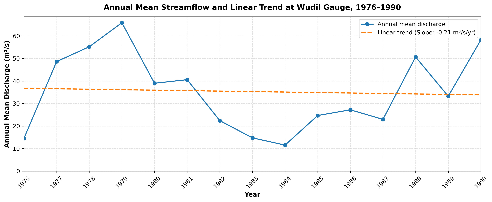

### Regression Results

| Metric  |                Result |
| ------- | --------------------: |
| Slope   | **−0.2098 m³/s/year** |
| R²      |            **0.0029** |
| p-value |            **0.8485** |

The fitted regression line has a slight negative slope, but the very low R² indicates that it explains very little of the observed variation in annual mean discharge. The p-value provides no statistical evidence of a detectable linear trend over the study period.

This result describes the fitted linear relationship only and does not establish the causes of the observed year-to-year variation.

---

# 10. Integrated Hydrological Interpretation

The Hadejia River watershed covers approximately **22,619.66 km²**, with a mean elevation of **552.53 m** and an elevation range of **334.07–1,568.76 m**, giving a relief of **1,234.69 m**. The area-weighted mean slope is relatively low at **2.16°**, while the watershed-specific slope analysis ranges from approximately **0° to 47.30°**, indicating that steeper terrain occurs locally within the watershed. The QSWAT-derived drainage network contains **791.96 km of mapped reaches**, corresponding to a mapped drainage density of **0.0350 km/km²**. The mapped network reaches a maximum stream order of **3rd order**.

The observed streamflow record at the Wudil gauge contains **5,479 daily observations** covering **1976–1990**, with no missing discharge values after quality control. The mean discharge was **35.32 m³/s**, while the median was **14.00 m³/s**, indicating that higher-flow events substantially increase the overall mean. The flow-duration analysis also shows considerable variation between relatively high- and low-flow conditions, with **Q10 = 95.9 m³/s**, **Q50 = 14.0 m³/s**, and **Q90 = 1.9 m³/s**.

The monthly climatology shows a clear seasonal pattern. Streamflow is generally lower from January to April, increases during May and June, reaches its highest average value in **August (115.80 m³/s)**, and declines through September and October. A total of **60 recorded zero-discharge days** occurred during the study period, concentrated in a small number of years. These observations describe the temporal behaviour of the gauge record but do not by themselves establish the causes of the observed variations.

The annual mean discharge series varies considerably between years. A simple linear regression produced a slope of **−0.21 m³/s/year**, but the **R² of 0.0029** indicates that the fitted line explains very little of the variation, while the **p-value of 0.8485** provides no statistical evidence of a detectable linear trend over the 1976–1990 period.

Overall, the analysis combines the physical watershed context provided by GIS with the observed temporal behaviour of streamflow at Wudil. The results should be interpreted as a combined assessment of watershed characteristics and observed hydrological behaviour rather than as a causal rainfall–runoff model.

---

# 11. Key Results

### Watershed and Terrain

| Parameter                |            Result |
| ------------------------ | ----------------: |
| Watershed area           | **22,619.66 km²** |
| Perimeter                |   **2,305.48 km** |
| Mean elevation           |      **552.53 m** |
| Minimum elevation        |      **334.07 m** |
| Maximum elevation        |    **1,568.76 m** |
| Relief                   |    **1,234.69 m** |
| Area-weighted mean slope |         **2.16°** |
| Maximum localized slope  |        **47.30°** |
| QSWAT subbasins          |            **10** |

### Drainage and Morphometry

| Parameter                   |                   Result |
| --------------------------- | -----------------------: |
| Mapped reach length         |            **791.96 km** |
| Mapped drainage density     |        **0.0350 km/km²** |
| Mapped reaches              |                   **10** |
| Highest mapped stream order |            **3rd order** |
| Mapped reach frequency      | **0.000442 reaches/km²** |
| Compactness coefficient     |                 **4.32** |

### Observed Streamflow

| Parameter                    |          Result |
| ---------------------------- | --------------: |
| Gauge                        |       **Wudil** |
| GRDC Station ID              |     **1837410** |
| Study period                 |   **1976–1990** |
| Daily observations           |       **5,479** |
| Mean discharge               |  **35.32 m³/s** |
| Median discharge             |  **14.00 m³/s** |
| Minimum discharge            |   **0.00 m³/s** |
| Maximum recorded discharge   | **704.68 m³/s** |
| Standard deviation           |  **58.09 m³/s** |
| Q10                          |   **95.9 m³/s** |
| Q50                          |   **14.0 m³/s** |
| Q90                          |    **1.9 m³/s** |
| Recorded zero-discharge days |          **60** |
| Zero-discharge proportion    |       **1.10%** |

### Trend

| Metric             |                Result |
| ------------------ | --------------------: |
| Linear trend slope | **−0.2098 m³/s/year** |
| R²                 |            **0.0029** |
| p-value            |            **0.8485** |

---

# 12. Limitations

* The observed streamflow analysis covers **1976–1990**, rather than the full period available in the original GRDC record.
* The streamflow analysis uses observations from a single gauge station at Wudil.
* The project describes observed streamflow behaviour but does not include a rainfall–runoff simulation.
* The QSWAT-derived drainage network represents the mapped network generated from the selected DEM and delineation settings and should not be treated as a complete inventory of all natural channels.
* Drainage density and reach frequency therefore refer specifically to the **mapped QSWAT-derived network**.
* The slope classes were selected for hydrological representation and cartographic interpretation rather than being presented as universal hydrological thresholds.
* Recorded zero-discharge values were retained as reported in the dataset and were not independently validated against field observations.
* The linear trend analysis tests only a simple linear relationship between annual mean discharge and year and does not account for other potential controls on streamflow.
* The project does not establish causal relationships between rainfall, land cover, groundwater conditions, and observed streamflow.

---

# 13. Project Structure

```text
Hadejia-River-Hydrological-Assessment/
│
├── README.md
│
├── documentation/
│   ├── DATA_SOURCES.md
│   ├── METHODOLOGY.md
│   └── PROCESSING_NOTES.md
│
├── notebook/
│   └── Hadejia_Streamflow_Hydrological_Analysis.ipynb
│
├── maps/
│   ├── Map_1_Watershed_Overview.jpeg
│   ├── Map_2_Subbasins_Drainage_Network.jpeg
│   ├── Map_3_Slope.jpeg
│   └── Map_4_Land_Cover.jpeg
│
└── figures/
    ├── Figure_1_Daily_Streamflow.png
    ├── Figure_2_Monthly_Mean_Streamflow.png
    ├── Figure_3_Annual_Mean_Streamflow.png
    ├── Figure_4_Flow_Duration_Curve.png
    ├── Figure_5_Monthly_Climatology.png
    ├── Figure_6_High_Low_Flow_Days.png
    ├── Figure_7_Annual_CV.png
    └── Figure_8_Annual_Streamflow_Trend.png
```

---

# 14. Reproducibility

The project separates spatial watershed analysis from observed streamflow analysis.

### QGIS / QSWAT

Used for:

* DEM preparation
* Watershed delineation
* Subbasin generation
* Terrain analysis
* Elevation statistics
* Slope analysis
* Drainage-network extraction
* Morphometric analysis
* Land-cover processing
* Map production

### Python / Jupyter Notebook

Used for:

* Reading and processing GRDC daily streamflow data
* Date filtering and quality control
* Daily, monthly, and annual discharge analysis
* Flow-duration analysis
* High- and low-flow thresholds
* Zero-discharge analysis
* Monthly climatology
* Annual coefficient of variation
* Linear trend analysis and visualization

The **area-weighted mean slope of 2.16°** was calculated from QGIS-derived zonal statistics and incorporated into the integrated analysis.

Detailed scientific methods and calculation procedures are provided in [`documentation/METHODOLOGY.md`](documentation/METHODOLOGY.md), while practical processing decisions are documented in [`documentation/PROCESSING_NOTES.md`](documentation/PROCESSING_NOTES.md).

---

# 15. Data Availability and Sources

Primary external data sources include:

* **USGS EarthExplorer** — 30 m SRTM elevation data
* **HydroSHEDS / HydroBASINS** — Africa Level 6 basin reference
* **Global Runoff Data Centre (GRDC)** — Wudil gauge observations
* **ESA WorldCover** — 2021 land-cover data

The original GRDC `.day` streamflow file is not included in the repository unless redistribution rights permit. The documentation provides the dataset description, station information, study period, and processing workflow required to understand and reproduce the analysis.

See [`documentation/DATA_SOURCES.md`](documentation/DATA_SOURCES.md) for detailed data provenance and source information.

---

# 16. Documentation

Detailed project documentation is provided in the `documentation/` folder:

* [`DATA_SOURCES.md`](documentation/DATA_SOURCES.md) — datasets, sources, provenance, coordinate systems, and data limitations.
* [`METHODOLOGY.md`](documentation/METHODOLOGY.md) — scientific workflow, formulas, calculations, and analytical methods.
* [`PROCESSING_NOTES.md`](documentation/PROCESSING_NOTES.md) — practical processing decisions, GIS issues, corrections, and workflow notes.

---

# 17. Author

**Ayomide Odunayo Agbede**

Hydrogeophysicist | Hydrogeology | GIS & Remote Sensing

Nigeria
